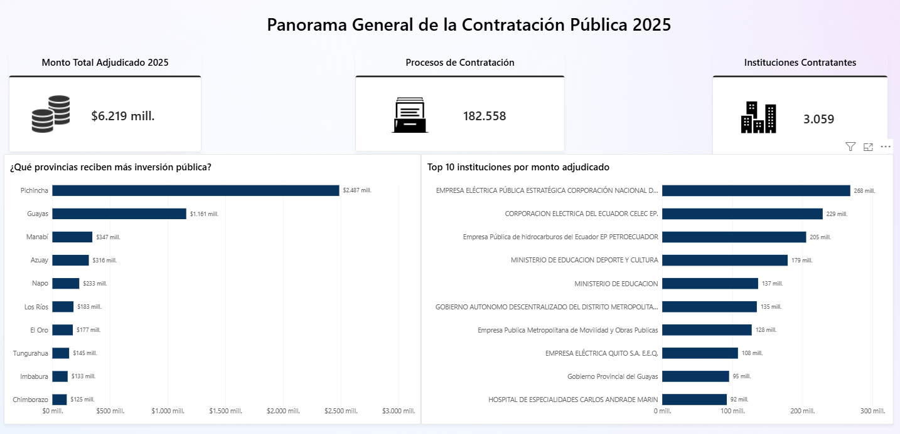
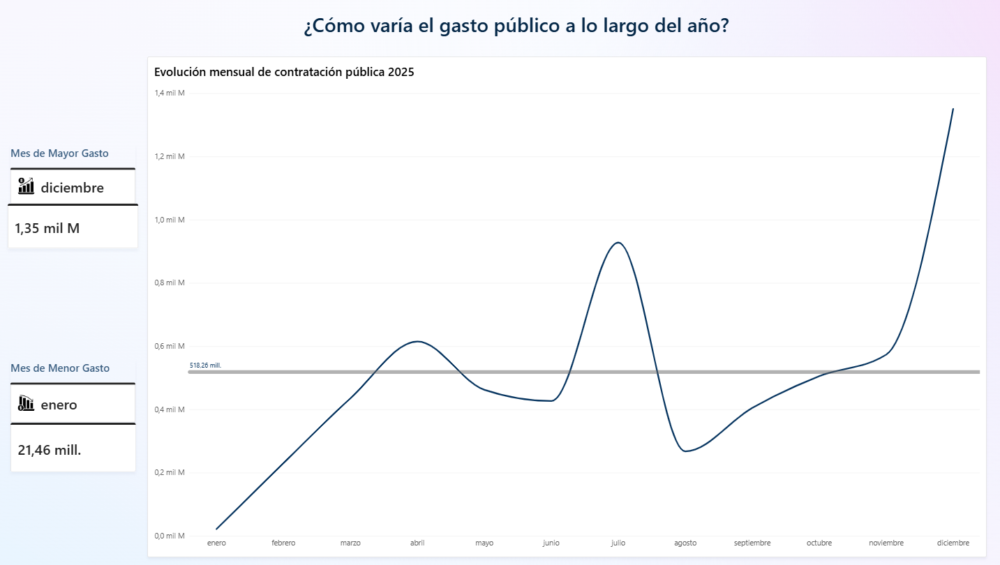
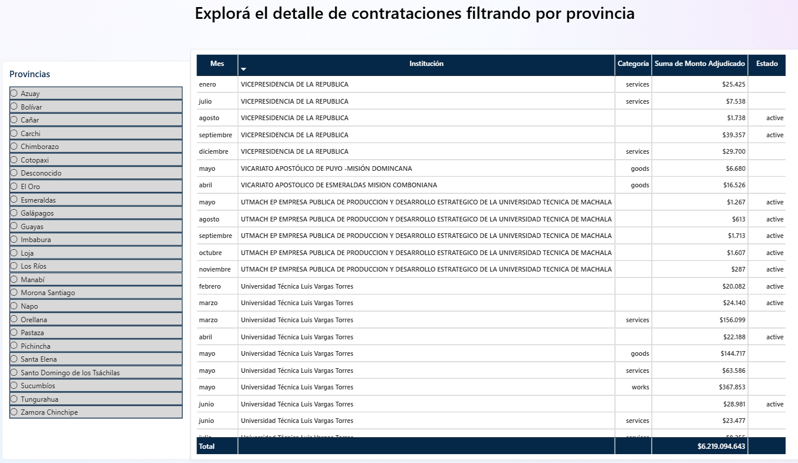
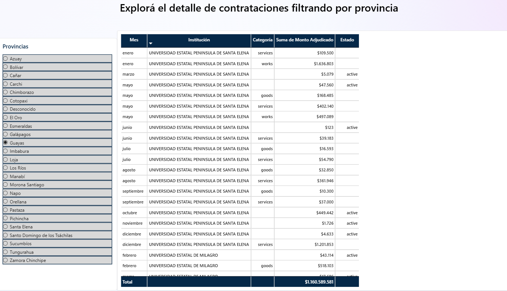

# **Dashboard de Contratación Pública en Ecuador (2025)**

Análisis y visualización de los procesos de contratación pública ejecutados por el Estado ecuatoriano durante 2025, con foco en la distribución del gasto por provincia, institución y evolución temporal.

  

---

## **Contexto y pregunta de negocio**

El Servicio Nacional de Contratación Pública (SERCOP) publica de forma abierta el detalle de todas las compras que realiza el Estado ecuatoriano, siguiendo el estándar internacional **OCDS** (Open Contracting Data Standard). Este proyecto busca responder:

> **¿Qué provincias e instituciones concentran mayor inversión pública en Ecuador, y cómo evoluciona el gasto a lo largo del año?**

---

## **Vista previa del dashboard**

| Panorama General | Evolución Temporal | Detalle por Provincia | Detalle por Provincia Seleccionada |
| ----- | ----- | ----- | | ----- |
|  |  |  |  |

El dashboard interactivo cuenta con 3 páginas:

1. **Panorama General:** KPIs generales (monto total, procesos, instituciones), ranking de provincias por inversión y top 10 instituciones por monto adjudicado.  
2. **Evolución Temporal:** tendencia mensual del gasto público, con línea de promedio de referencia y tarjetas destacando el mes de mayor y menor gasto del año.  
3. **Detalle de Procesos:** tabla filtrable por provincia, con segmentador interactivo para explorar procesos individuales.

---

## **Fuente de datos**

* **Portal:** [Datos Abiertos de Contratación Pública \- SERCOP](https://datosabiertos.compraspublicas.gob.ec/PLATAFORMA/datos-abiertos)  
* **Formato:** OCDS (Open Contracting Data Standard), descarga masiva en CSV  
* **Período analizado:** enero a diciembre de 2025  
* **Archivos utilizados:** `awards` (adjudicaciones) y `tender` (procesos de contratación), de los 12 meses del año

El estándar OCDS separa la información en múltiples tablas relacionadas (`awards`, `tender`, `suppliers`, `contracts`, `planning`, entre otras). Para este análisis se combinaron `awards` y `tender` mediante su identificador común (`ocid`).

---

## **Metodología**

### **1\. Extracción y unión de datos**

Se descargaron los archivos `awards` y `tender` de cada mes de 2025 y se unieron mediante la clave `ocid`, usando un pipeline en Python (`pandas`).

### **2\. Inferencia de provincia**

El dataset **no incluye una columna explícita de provincia** para la entidad contratante. Se infirió a partir de los dos primeros dígitos del RUC de la entidad (`procuringEntity_id`), siguiendo la codificación oficial de provincias del SRI/Registro Civil de Ecuador (01 \= Azuay, 09 \= Guayas, 17 \= Pichincha, etc.).

### **3\. Filtrado de registros válidos**

Se excluyeron los registros de `awards` sin un monto (`amount`) numérico válido, correspondientes en su mayoría a procesos de tipo concurso/mejor oferta con estructura de datos distinta.

### **4\. Agregaciones**

Se generaron tres datasets de salida:

* `contratacion_2025_completo.csv`: detalle completo, nivel de proceso individual  
* `resumen_mensual_por_provincia.csv`: totales agregados por mes y provincia  
* `resumen_por_institucion.csv`: totales agregados por institución contratante

### **5\. Visualización**

El dashboard final se construyó en **Power BI Desktop**, con tres páginas: panorama general, evolución temporal y detalle filtrable por provincia. Se aplicó una paleta de colores institucional consistente y medidas DAX personalizadas para enriquecer el análisis (línea de promedio anual, identificación automática del mes de mayor/menor gasto).

---

## **Problemas encontrados y solución**

Durante el desarrollo se identificaron y resolvieron varios problemas de calidad de datos y de modelado, documentados aquí como evidencia del proceso de depuración:

| Problema | Causa | Solución |
| ----- | ----- | ----- |
| Monto total inflado \~65x en Power BI | Power Query interpretó el punto decimal como separador de miles (configuración regional) | Se forzó la conversión de tipo con configuración regional "Inglés (Estados Unidos)" en Power Query |
| Columna `date` vacía en el 100% de los registros | El campo `date` de `awards` no viene poblado en este dataset; la fecha real está embebida como texto dentro de `release_id` | Se extrajo la fecha mediante una expresión regular sobre `release_id` |
| Orden alfabético incorrecto de meses en gráficos | Power BI ordena texto alfabéticamente por defecto | Se agregó una columna auxiliar `mes_numero` y se configuró el ordenamiento personalizado de columna en Power BI |
| Medida DAX de "mes con mayor/menor gasto" devolvía siempre el mismo valor incorrecto | La comparación por igualdad exacta (`FILTER(... = ...)`) fallaba por precisión decimal entre el cálculo dentro y fuera de la tabla virtual | Se reescribió la medida usando `TOPN` para seleccionar directamente la fila extrema, sin depender de una coincidencia exacta de valores |

---

## **Hallazgos principales**

* **Concentración geográfica esperada, con una excepción notable:** Pichincha y Guayas encabezan el ranking de inversión pública (consistente con la concentración de instituciones y ministerios), pero **Napo aparece en el top 5**, con un volumen de procesos moderado (\~6,500) pero montos promedio elevados — sugiere concentración en pocos proyectos de alto valor, posiblemente de infraestructura.

* **Fuerte estacionalidad en el gasto público:** el mes de mayor gasto fue **diciembre** ($1,350 millones), mientras que el de menor gasto fue **enero** ($21 millones) — una diferencia de más de 60 veces entre ambos extremos. Se observa además una caída marcada en agosto-septiembre. Este patrón es consistente con la dinámica de ejecución presupuestaria del sector público, donde las instituciones tienden a acelerar sus contrataciones antes del cierre del año fiscal.

* **El 83% de los procesos no tiene categoría de bien/servicio/obra asignada:** se identificó que esto corresponde sistemáticamente a contrataciones por **Catálogo Electrónico** (Compra Directa o Mejor Oferta), un mecanismo que el estándar OCDS de SERCOP no clasifica bajo `mainProcurementCategory`, a diferencia de procesos competitivos como Subasta Inversa o Licitación. Esto también revela que la gran mayoría del gasto público analizado se ejecuta por compra directa de catálogo, en lugar de procesos competitivos tradicionales.

* **Principales instituciones contratantes:** empresas públicas estratégicas del sector energético (CELEC, Empresa Eléctrica Quito) y petrolero (Petroecuador) encabezan el ranking, seguidas de ministerios de Educación y gobiernos autónomos descentralizados.

---

## **Limitaciones conocidas**

* **Discrepancia con el tablero oficial "Contratación en Cifras" del SERCOP:** dicho tablero reporta un total de $7,318 millones y 411,084 procesos para 2025, sumando los regímenes de Común y Especial, Ínfima Cuantía y Emergencias. El presente análisis, basado en el dataset OCDS de descarga masiva, totaliza $6,219 millones y 182,558 procesos. La diferencia sugiere que el dataset OCDS no captura la totalidad de los regímenes de contratación (particularmente Ínfima Cuantía y Emergencias) y podría no incluir el 100% de los procesos del Régimen Común y Especial. Se documenta esta discrepancia como limitación conocida.  
* La provincia de la entidad contratante fue **inferida** a partir del RUC, no tomada de un campo oficial — un 0.05% de registros no pudo clasificarse (categoría "Desconocido").  
* El análisis usa la ubicación de la **entidad contratante**, no del proveedor adjudicado, ya que este dato no está disponible en el dataset de proveedores.

---

## **Estructura del repositorio**

contratacion-publica-ecuador/

│

├── README.md

├── procesar\_contratacion\_publica.py

├── data/

│   ├── raw/              \# awards y tender de cada mes (no incluidos por tamaño)

│   └── processed/        \# datasets ya limpios y agregados

├── dashboard/

│   └── DASHBOARD\_CONTRATACION\_PUBLICA\_PROVINCIAS.pbix

└── images/

&nbsp;&nbsp;&nbsp;&nbsp;├── panorama\_general.png

&nbsp;&nbsp;&nbsp;&nbsp;├── evolucion\_temporal.png

&nbsp;&nbsp;&nbsp;&nbsp;└── detalle\_provincia.png

&nbsp;

---

## **Cómo reproducir este proyecto**

1. Clonar el repositorio  
2. Descargar los archivos `awards` y `tender` de cada mes de 2025 desde el [portal de datos abiertos de SERCOP](https://datosabiertos.compraspublicas.gob.ec/PLATAFORMA/datos-abiertos) y colocarlos en `data/raw/`  
3. Instalar dependencias: `pip install pandas`  
4. Ejecutar `python procesar_contratacion_publica.py`  
5. Abrir `dashboard/DASHBOARD_CONTRATACION_PUBLICA_PROVINCIAS.pbix` en Power BI Desktop y actualizar los datos

---

## **Próximos pasos**

* Cruzar el listado de proveedores con su ubicación (usando su propio RUC) para analizar concentración geográfica del lado de la oferta  
* Detección de anomalías: proveedores con concentración desproporcionada de contratos, o precios fuera de rango para su categoría  
* Incorporar los regímenes de Ínfima Cuantía y Emergencias para tener una visión completa del gasto público total

---

## **Autor**

**Felix Damian Villegas Fajardo** Lic. en Análisis de Datos https://www.linkedin.com/in/felixvillegasfajardo2001/ **·** https://github.com/felixda9090 **·** felixfaja30@outlook.es

&nbsp;
